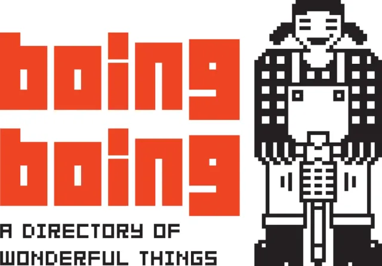

# BoingBoing
SMX2M8UF1A3_Historia de la web Boing Boing

[Bonig Boing](https://boingboing.net/ "Bonig Boing"), un popular blog y sitio web, tiene una historia interesante que comenzó en 1988 cuando [Mark Frauenfelder](https://en.wikipedia.org/wiki/Mark_Frauenfelder "Mark Frauenfelder") y [Carla Sinclair](https://en.wikipedia.org/wiki/Carla_Sinclair/ "Carla Sinclair") fundaron una revista impresa llamada "Boing Boing: The Directory of Wonderful Things". La publicación se centró en la tecnología, la cultura hacker y la contracultura.

Con el tiempo, Boing Boing evolucionó y se convirtió en un sitio web en 1995, donde exploraron una variedad de temas, desde la ciencia hasta la política y la cultura pop. El sitio ganó notoriedad por su estilo irreverente y su capacidad para descubrir tendencias y noticias fuera de lo común.

Boing Boing también se destacó por su enfoque en la cultura de código abierto, los derechos digitales y la libertad en línea. Fue una voz influyente en la defensa de la privacidad y la lucha contra la censura en internet.

En resumen, Boing Boing es una plataforma que ha pasado de ser una revista de contracultura a un influyente blog en línea que aborda una amplia gama de temas. A lo largo de los años, ha mantenido su espíritu de exploración y su compromiso con la innovación y la libertad en línea.

